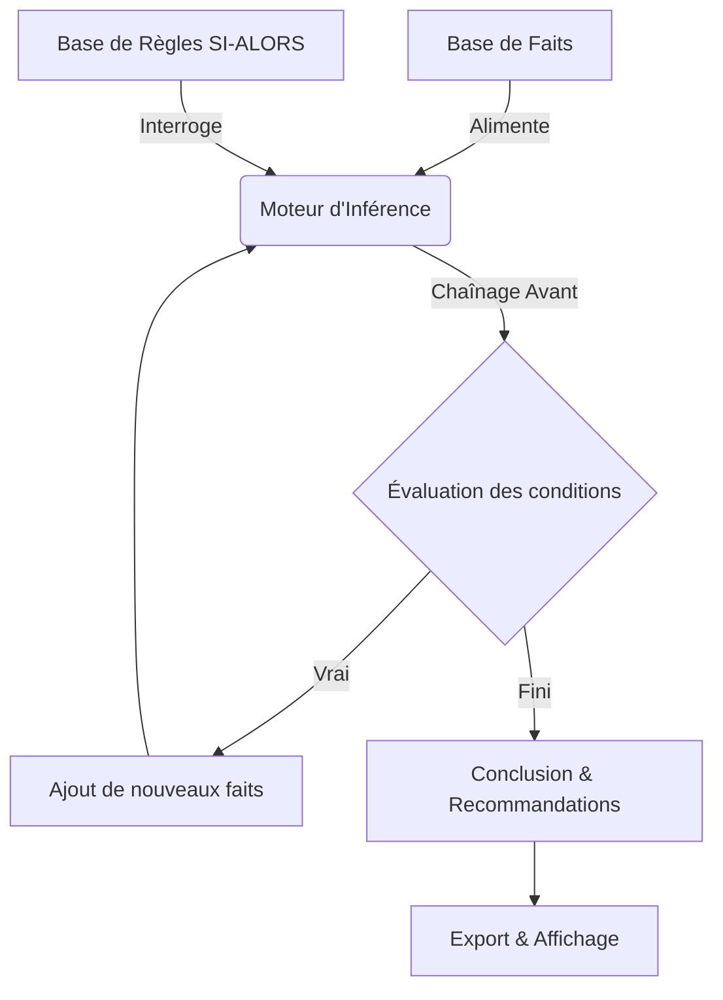
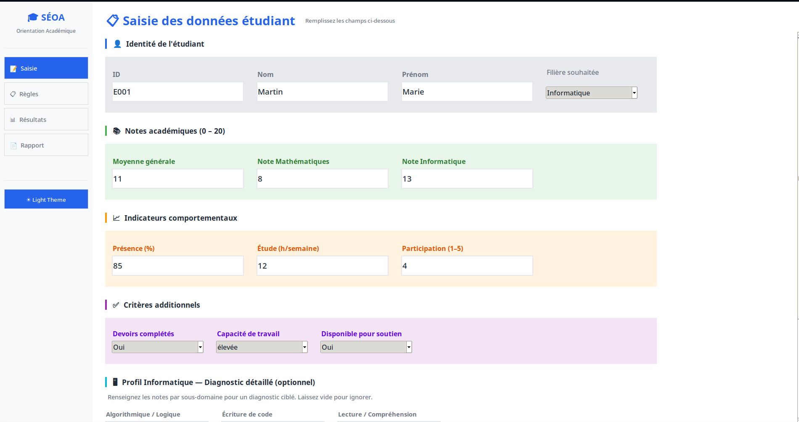

# 🎓 SÉOA — Système Expert d'Orientation Académique

<div align="center">


**Un système expert d'aide à la décision pour l'orientation et l'accompagnement pédagogique des étudiants**

[📖 Vue d'ensemble](#-vue-densemble) • [✨ Fonctionnalités](#-fonctionnalités) • [🧠 Architecture](#-architecture--fonctionnement) • [🚀 Installation](#-installation-et-lancement) • [️ Démo](#-capture-et-démo)

</div>

---

## 📋 Table des matières

- [📖 Vue d'ensemble](#-vue-densemble)
- [✨ Fonctionnalités](#-fonctionnalités)
- [🧠 Architecture & Fonctionnement](#-architecture--fonctionnement)
- [🛠️ Technologies Utilisées](#️-technologies-utilisées)
- [📁 Structure du Projet](#-structure-du-projet)
- [⚙️ Installation et Lancement](#-installation-et-lancement)
- [🖼️ Capture et Démo](#-capture-et-démo)
- [🎓 Valeur Académique](#-valeur-académique)
- [👨‍🎓 Auteur](#-auteur)

---

## 📖 Vue d'ensemble

**SÉOA** (Système Expert d'Orientation Académique) est un logiciel d'aide à la décision développé dans le cadre de mon **Projet de Fin d'Études de Master**. Il implémente un **moteur d'inférence en chaînage avant** pour évaluer le profil académique et comportemental des étudiants, afin de recommander une **orientation adaptée** ainsi que des **dispositifs de soutien pédagogique ciblés**.

> 💡 **Objectif** : Automatiser et objectiver le processus d'orientation en s'appuyant sur des règles métier explicites, une analyse multi-critères et une interface ergonomique.

---

## ✨ Fonctionnalités

| Catégorie | Description |
| :--- | :--- |
| 📝 **Saisie complète** | Identité, notes académiques (Maths, Info, Moyenne) et indicateurs comportementaux (présence, heures d'étude). |
| 🧠 **Moteur d'inférence** | Raisonnement structuré en 4 phases : `Motivation → Potentiel → Orientation → Diagnostic Informatique`. |
| 📊 **Diagnostic CS détaillé** | Analyse approfondie des sous-compétences informatiques (Algorithmique, Base de données, Réseaux, etc.). |
| 🎨 **Gestion des thèmes** | Bascule dynamique et fluide entre un thème **Clair (Light)** et **Sombre (Dark)**. |
| 📤 **Export des rapports** | Sauvegarde automatique de la session et exportation des bilans aux formats `HTML`, `TXT` et `JSON`. |

---

## 🧠 Architecture & Fonctionnement

SÉOA suit le paradigme classique des systèmes experts en IA symbolique :



### 🔄 Cycle d'inférence (4 phases)
1. **Motivation** : Évaluation de l'assiduité, de l'implication et des habitudes d'étude.
2. **🔍 Potentiel** : Analyse des résultats académiques et des compétences transversales.
3. **🎯 Orientation** : Matching du profil avec les filières/spécialités adaptées.
4. **💻 Diagnostic Informatique** : Granularité fine sur les sous-compétences du domaine informatique pour proposer un plan de remédiation personnalisé.

---

## 🛠️ Technologies Utilisées

- 🐍 **Langage** : Python 3.8+
- 🖥️ **Interface Graphique** : `tkinter`, `ttk` (Thèmes personnalisés)
-  **Architecture** : `dataclasses`, `enums`, Programmation Orientée Objet (POO)
-  **Export & Données** : `json`, `html`, `pathlib`
-  **Tests** : Scripts de tests unitaires et fonctionnels

> ✅ **Aucune dépendance externe requise**. Le projet fonctionne avec la bibliothèque standard Python + Tkinter (inclus nativement).

---

## 📁 Structure du Projet

```text
SEOA/
│
├── assets/
│   ├── system.png                  # Capture d'écran de l'interface
│   └── pocvideo.gif                # Démo vidéo de l'application
│
├── enums.py                        # Énumérations pour les constantes et types
├── models.py                       # Dataclasses : Étudiants, Faits, Résultats
── rules.py                        # Base de règles logiques (SI → ALORS)
├── inference_engine.py             # Moteur d'inférence (Chaînage avant)
├── support_system.py               # Catalogue & logique de recommandation
── gui.py                          # Interface graphique Tkinter professionnelle
├── main.py                         # Point d'entrée (Mode console)
├── test.py                         # Tests du système
├── .gitignore                      # Fichiers ignorés par Git
└── README.md                       # Documentation
```

---

## ️ Installation et Lancement

### Prérequis
- 🐍 Python 3.8 ou supérieur
- 🖥️ Tkinter (généralement préinstallé avec Python)

### 🚀 Exécution

**1. Mode Interface Graphique (Recommandé)**
```bash
python gui.py
```

**2. Mode Console (Automatisé / Scripting)**
```bash
python main.py
```

**3. Lancer les tests**
```bash
python test.py
```

---

## 🖼️ Capture et Démo

### 🖥️ Interface Principale
<div align="center">
  
</div>

### 🎬 Démonstration Vidéo
<div align="center">
  <video src="./assets/pocvideo.gif" controls preload width="800" style="border-radius: 10px; box-shadow: 0 4px 8px rgba(0,0,0,0.2);">
    Votre navigateur ne supporte pas la balise vidéo.
  </video>
</div>

---

## 🎓 Valeur Académique

Ce projet de Master démontre la maîtrise des concepts suivants :
- ✅ **IA Symbolique** : Chaînage avant, base de règles, moteur d'inférence.
- ✅ **Ingénierie Logicielle** : Architecture modulaire, séparation des responsabilités.
- ✅ **UX/UI Design** : Interface ergonomique, gestion des thèmes, feedback utilisateur.
- ✅ **Python Avancé** : Utilisation de `dataclasses`, `enums` et design patterns.

---

## 👨‍🎓 Auteur

</div>

### 🎓 Master's Student in Artificial Intelligence & Emerging Technologies (IATE)

**📍 Morocco** | **📧 mohammed.boujaada@ump.ac.ma**

[](https://www.linkedin.com/in/mohammed-boujaada-229a3333a/)
[](https://github.com/mohammed-boujaada)
[](mailto:mohammed.boujaada@ump.ac.ma)

</div>

---

<div align="center">

### ⭐ Si ce projet vous a été utile ou inspire vos recherches, n'hésitez pas à lui donner une étoile !

**Conçu avec rigueur académique et passion pour l'IA symbolique ❤️‍**

</div>

